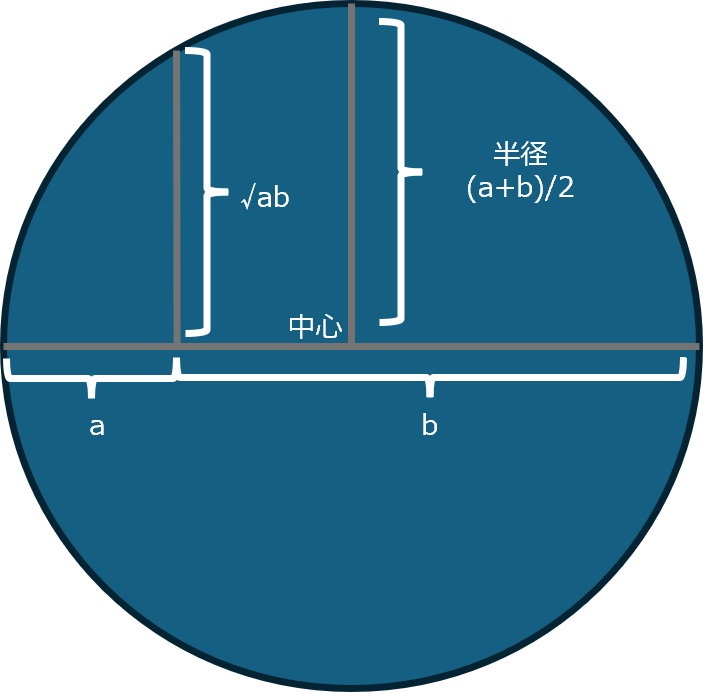
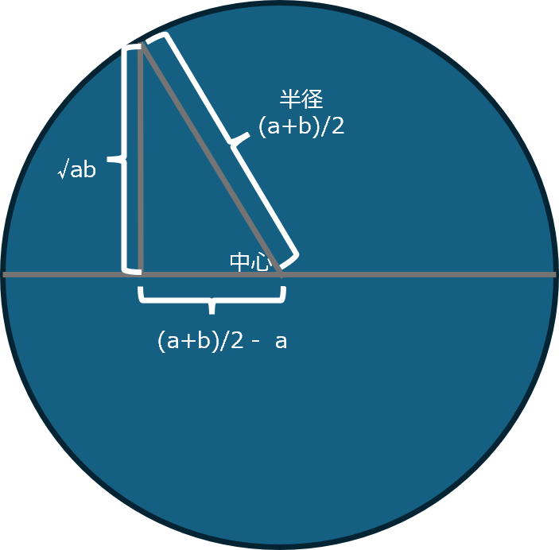
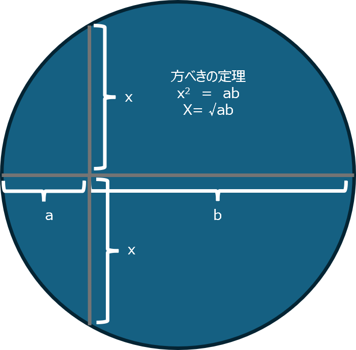

## [ホームに戻る](../index.html)

# 統計学:相加平均と相乗平均

相加平均　average  
    (x₁ + x₂ + … + xₙ) ÷ n

相乗平均　geomean  
    ( x₁ × x₂ × … × xₙ )^(1/n)  

# 相乗平均の対数は対数の相加平均

log( (x₁ × x₂ × … × xₙ)^(1/n) ) = (log x₁ + log x₂ + … + log xₙ) / n    

ex.  
    log(1 * 10 * 100 * 1000^(1/4)) = (log 1 + log 10 + log 100 + log 1000) /4

# 相加平均と相乗平均の使い分け

足し算で意味があるデータの平均は、相加平均　　
掛け算で意味があるデータの平均は、相乗平均  

「意味がある」とは打倒かどうか。  

1年目 +10%、2年目 +20% の成長率の平均成長率を相加平均15％とするのは妥当ではない。  
妥当な平均成長率とは  

１年目|+10%|1.1倍
-|-|-
2年目|+20%|1.2倍  

1.1 * 1.2 = 1.32倍 ＝　32%成長  

(1+r)^2 = 1.32  

1+r = √1.32 ≈　1.1489  

r = 0.1489 平均成長率は約15％とみなすのが打倒　　

相乗平均を行う際のサンプルは比率や増減率となる

---

# よくある関係図

相加平均 ≥ 相乗平均

(a+b)/2   ≥  √ab  
※ a > 0 , b > 0

√abは下記の考えから求めている

√abは方べきの定理からも求めることができる

# 物流における相加平均と相乗平均の使い分けの重要性

物流のKPIで改善率、積載率、成長率などの比率を相加平均で計算すると誤解を招く  

積載率が50％減ったが、翌年50％増えた　　

相加平均：　(-50% + 50%)/2  = 0%  
相乗平均：  √0.5*1.5 ≊　86.6% >>> -13.4%/年 

## [ホームに戻る](../index.html)