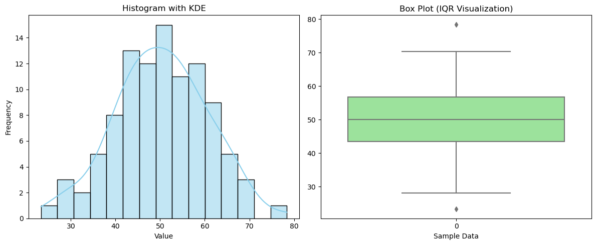

## [ホームに戻る](../index.html)

# 統計学:データのバラつきを考える

統計学で登場するバラつきを示す代表的指標

- Range(範囲)
- Variance（分散）
- Standard Deviation(標準偏差)
- IQR（四分位範囲）

直感的に理解するのにはヒストグラムがいい  
現場受けもするので、だいたいヒストグラムを見せて、単純に平均値を採用する危険性を伝えられる。  
箱ひげ図は、25％刻みなので、抽象的になりすぎて反応が悪いことが多い。

# 分散　σ²

σ²　= (偏差)^2 / n

偏差：データ値と平均との差　　
ただ偏差を合計するだけでは0になってしまうため、二乗してバラつき具合を図る。  
偏差を二乗してその平均を取った値が分散となる。
偏差の合計が0になることを克服するため、二乗して平均をとっている。

偏差の合計：０なる  

        x̄       =　Σ(各データ) 　/　n
        n * x̄　 =　Σ(各データ)  
        
        偏差は各データと平均との差なので、　　
        
        Σ(各データ - x̄)　= Σ（各データ）　-  n * x̄　= 0  
    
---

# なぜ絶対値ではだめなのか？  

1.  絶対値は不連続（0の点）なので微分できない。最適解を求める計算で二乗が好都合。
2.  絶対値は直線的なのに対して、二乗は面積、偏差が大きいほど値が大きくなるので、外れ値の影響が大きくでる。
3.  計算がめんどう。（絶対値だとマイナスかプラスか判断して、マイナスをかける、プラスをかけるなど決める）

※絶対値で計算した"平均偏差"という指標もあるが、、、あまり使わない。

---

# 標準偏差　√σ²　
平均偏差のようなもの
スケールが元データに戻るので直感的にもわかりやすくなる

---

# （自戒のため）標本誤差

母集団を推測するときは「標本誤差」　という概念が登場する。時々ごちゃまぜになる。。。
推測統計で、母集団から標本をとりだしたときに、標本統計量と母集団の真の値とのズレを「標本誤差」という。　　
英語だと「sampling error」なんで、英語で読んだ方が意味がわかりやすい。

## [ホームに戻る](../index.html)