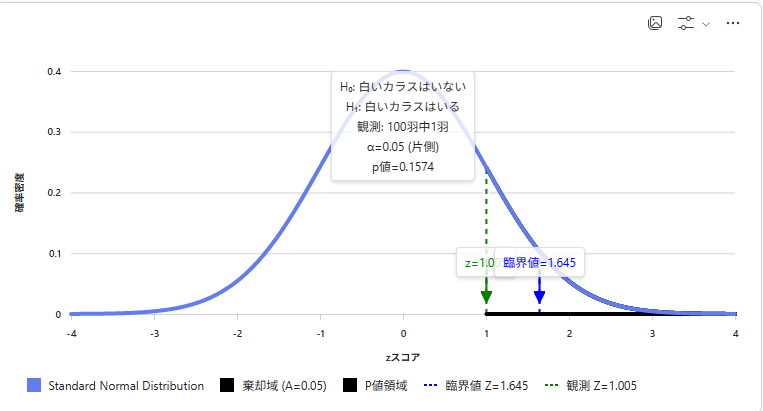

## [ホームに戻る](../index.html)

# 統計学:P値

p値が腑に落ちない期間が長くあった。　　

もろもろの学習教材、Youtuberのおかげで、わからせてもらえるようになった。  

p値理解を困難にさせる背景として、p値が登場する統計検定の文脈で諸々新しい用語がでるためだった。

 帰無仮説  
 有意水準(α)  
 臨海値  
 棄却域

もセットで理解、整理していかないといけない。

---

# 帰無仮説とp値

統計検定の文脈で、否定したい仮説のことを帰無仮説とする。

- このコインは正しいコインである（表、裏出る確率が0.5なのか怪しいんで検定）
- メーカーが平均内容量は１５０ｍｌと主張している（違うだろうと怪しいんで検定）
- 白いカラスはいない（「白いカラスはいる」という存在証明を棄却するのは難しい。対立仮説として統計的に白いカラスを見つけるという仮説設定のほうが適している）

帰無仮説に設定した仮説を無に帰すために検定を行う。帰無仮説を論破して否定、つぶすのが統計検定。

帰無仮説の条件のもとで、観測されたデータのz値（分布上のスコア）を確認。

確認したｚ値が起こる確率をp値。

否定したい仮説のもとで観測するデータのなので、
p値は「どのくらいレアな」確率、という形容詞がつくことなる

あなたの帰無仮説認めたら、ここにあるデータはpの確率でしか起きないレアケースじゃないか？
という投げかけを行う態度

「レア」とみなす基準（有意水準）を設定して、pの確率がこのくらいだったら、レアなものとして、棄却できるものとみなす
という論法になる。

---

# 有意水準、臨海値、棄却域

手元にある観測データがどのくらいの確率で起きるか（p値）を確認する前に、　　
棄却（否定する）基準を設定する。その設置値が有意水準になる。　　

レア度をみなす基準を有意水準として設定する。

その基準に達したとき、有意差あり（帰無仮説を棄却できる）と主張できる。

有意水準を決めると、有意水準をに対応する分布上の臨海値が把握できる。　　

例えば、有意水準　0.05で、片側検定ならば、z ≈ 1.645が臨海値。

臨海値は棄却域(z値の範囲)との境界線になる。

---
# 用語の関係性の整理

z値　VS　臨海値　　＞＞　分布上の位置を比較
-  z値：観測データを標準化した位置（標準正規分布上のスコア）。
-  臨海値：有意水準（α）に基づいて決める「境界の数値」。臨界値より極端な値の範囲を「棄却域」と呼ぶ。

p値　VS　有意水準　＞＞　確率を比較
-  p値：帰無仮説の下で、観測結果以上に極端な結果が出る確率。z値のスコアから確認できる。
-  有意水準：帰無仮説を棄却する基準。

---

# 白いカラスはいないという帰無仮説

- 帰無仮説 (H₀)：「白いカラスはいない」
- 対立仮説 (H₁)：「白いカラスはいる」
- 観測データ：100羽中、白いカラス1羽
- 有意水準：0.05／臨海値：片側検定　1.645
- p値：0.1574／z値：1.005 

-  有意水準＜p値
‐　「白いカラスはないない」という帰無仮説は棄却できない

---
# 物流現場での応用事例  

オペレーションの改善活動の前後データの比較を行い、有意性を考える。　　

例えば、
改善活動前のオペレーションにかかる時間を記録して、サンプルを収集しておく  
改善活動後のオペレーションに用する時間を記録する　　

改善活動前のオペレーションにかかる平均時間、分布図に対して  
改善活動後のオペレーションにかかる平均時間のtスコア、p値を確認。　　

改善活動前のオペレーショ平均時間を基準とした分布図をベースとして、  
改善活動後のオペレーションにかかる平均時間がどのくらいの確率で確認できるスコアを確認することで、  
統計的検証で、改善が活動したか確認することができる。

## [ホームに戻る](../index.html)